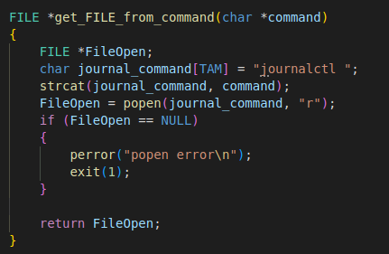
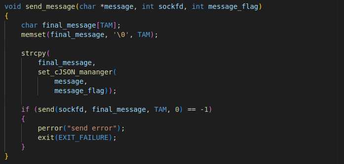
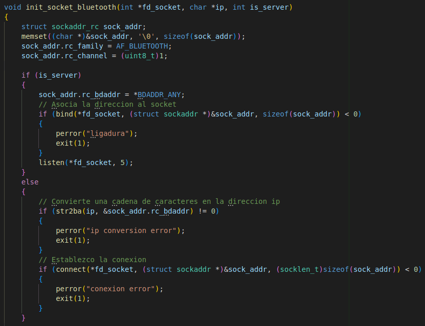

# LABORATORIO n° 2 - Interprocess Communication
## Descripción
Se realiza la comunicación clientes - servidor a través de 3 sockets distintos:\
Cliente A - Socket Internet\
Cliente B - Socket Unix\
Cliente C - Socket Bluetooth

Para la ejecución se necesitan las siguientes librerías:

- #sudo apt-get install libbluetooth-dev
- #sudo apt-get install zlib1g-dev
- #sudo apt-get install libssl-dev

acceso al repositorio: [gihub - branch develop](https://github.com/ICOMP-UNC/2023---soii---laboratorio-ii-F96G/tree/develop)

La implementación de estos clientes y su comunicación con un único servidor se explican a continuación:

### **Servidor**
Para empezar tanto clientes como servidor utilizan algunas funciones en común, por lo que se creo una librería estática llamada **common_utils**, por lo que se vera algunas funciones con flags que facilitan su reutilización:

#### Establecer la comunicación:
Para la comunicación entre los distintos tipos de sockets se crean 3 procesos hijos, los 3 listos para atender a cada tipo de socket cliente:\

Se puede observar que **init_socket(type)** devuelve un socket_file_descriptor, esta función es reutilizada múltiples veces tanto en clientes como en servidores ya que para cualquier tipo de socket su configuración es parecida:\

Luego vemos que cada tipo distinto de socket tiene su propia configuración, por ejemplo **init_socket_internet()**, si bien cada uno tiene argumentos especiales se aprecian 2 que son igual para cualquier tipo:
- **socket_file_descriptor** obtenido de **init_socket**.
- **flag inidcativo si se trata de un servidor** es el ultimo elemento pasado como argumento, tiene el propósito de discriminar el método de nacionalización del socket ya que difiere muy poco entre servidor y cliente.
  

Luego **client_manager** establece la comunicación para cada cliente a conectarse, se crea un nuevo proceso hijo para cada uno:

y por ultimo **new_client_manager** gestiona cada cliente nuevo de la forma que debe hacerlo para cada tipo de conexión:\

Aquí se pueden ver algunos detalles:
- primero se espera un único mensaje del cliente a atender.
- luego se obtiene su mensaje original del archivo JSON ya que todo mensaje es enviado en este tipo de estructura.
- Se verifica si se recibió "fin" indicando que el cliente quiere cerrar la comunicación.
- Y por ultimo se atiende al pedido dependiendo del tipo de cliente.

  
### **Cliente A - Socket Internet**
El cliente A recibe por variables 2 argumentos, el primero es la dirección ip del servidor (**argv[1]**) que puede ser **localhost** y el segundo es el puerto (**argv[2]**).

#### **Creando el socket**

Una vez creado el socket file descriptor se llama a **init_socket_internet()** que también es utilizado por el servidor

**init_socket_internet()** recibe 4 argumentos:

- primero el fd_socket para realizar la conexión
- luego el puerto (en formato de cadena de caracteres)
- siguiente la dirección ip
- por ultimo un flag indicador si la llamada la efectuá el servidor o el cliente.
 

La nacionalización del socket dependiendo del tipo es muy parecida para cada caso de socket implementado, sus diferencias se encuentran principalmente en los parámetros y configuraciones iniciales de cada tipo de socket

#### **Ejecutando la comunicación**
Empezando la comunicación entre cliente-servidor el cliente debe enviar un comando de "journalctl" al servidor.

El envió del mensaje se realiza con **send_message()** que sera explicado mas adelante. Enviado el mensaje se verifica si se escribió "fin" y se procede a destruir el cliente dado el caso, en caso contrario se espera recibir el mensaje con la función **get_message()**

Antes de explicar las llamadas a funciones antes nombradas veamos como trabaja la comunicación el servidor.

#### **Respuesta del servidor para socket internet**
Antes nombramos que el servidor hace un **read**, y luego de obtener el mensaje enviado por los clientes genera la respuesta dependiendo del tipo de socket, en este caso se llama a **journal_response()** con el mensaje recibido:

**journal_response()** toma el mensaje (que debería ser la llamada a journalctl) y llama a **get_FILE_from_command()** devolviendo la respuesta del comando dentro de un **FILE** luego lee con **fgets** el archivo en tramos de tamaños **TAM_SUB** y en caso de que el **FILE** no contenga nada, es probable que el comando sea invalido y se responde con un mensaje indicándolo.\
Una vez enviado todo el mensaje se enviá un ultimo mensaje "vacío" pero que contendrá un flag indicando que se ha realizado la transmisión y se procederá a esperar un nuevo mensaje.

**get_FILE_from_command()** crea un **FILE** con la respuesta al comando recibido con la función **popen**

### Enviar y recibir mensajes con **send_message()** y **get_message()**
Estas dos funciones se relacionan mucho y son muy utilizadas en la comunicación, comenzando con **send_message()**\
Este tiene 3 parámetros:
- **message**: es el mensaje puro a transmitir, preferentemente de tamaño igual o menor a **TAM_SUB**
- **sockfd**: es el socket file descriptor que gestiona la comunicación.
- **message_flag**: posiblemente el parámetro mas importante, define a través de bits que tipo de estructura de mensaje que se va a enviar.

Existen distintos flags que definen las estructuras de los mensajes:

Los mensajes finales se envían en formato jSON por lo que primero se toma el mensaje "en crudo" y se le da dicho formato, una vez el mensaje final listo se realiza el envió:

La librería cJSON **no garantiza** que el tamaño del mensaje final sea fijo por mas que el tamaño de los mensajes si lo sea, por lo que se le da al mensaje en crudo un tamaño **TAM_SUB** y el mensaje final tiene un tamaño máximo para su creación **TAM**

#### **set_cJSON_manager()**
Esta función devuelve el mensaje final, su implementación es crear un objeto cJSON y realizar un anidado de los elementos necesarios definidos por **message_flag** así al final la estructura del cJSON solo tendrá lo necesario para ese mensaje en particular.

por lo tanto tenemos 2 funciones para la creación del cJSON:

1. **init_cJSON_Flag_Final()**: Es el indicador si el mensaje es final o no, los mensajes generados por el servidor suelen ser tan grandes que deben dividirse en mensajes mas pequeños, para ello el servidor enviara partes del mensaje original hasta que le indique al cliente que recibió el ultimo.

2. **init_cJSON_Message_and_Checksum()**: Aquí se pondrá el "mensaje crudo" y se realizara el "hash de checksum" (si es que lo necesita) que luego sera revisado por el cliente.

Por otra parte tenemos **get_message()** que es quien gestiona el (o los) mensaje recibido para imprimir.\
Cuando se espera un mensaje no se sabe en cuantas sub partes se enviara, por lo que se realiza un bucle hasta recibir el mensaje con el indicador de que este es final, este valor estará en la variable **is_end**.

**get_jSON_manager()** obtiene el parceo del mensaje a travez de **final_message** que es quien tiene inicialmente el mensaje dentro del jSON, a la vez en caso de ser necesario se realiza el checksum y se verifica que sea correcto.

### **Cliente B - Socket Unix**
El cliente B al igual que el cliente A enviá un comando de "journalctl" pero esta vez espera por respuesta un binario respuesta contenida en un comprimido, el cliente realizara la descompresión y lee el mensaje. La comunicación se realiza a travez de un archivo compartido entre los procesos, el nombre del archivo esta almacenado en **argv[1]** y el nombre del comprimido es recibido en **argv[2]**

#### **Creando el socket**

**init_socket_unix()** mantiene una lógica parecida a la inicialización de los demás sockets:

#### **Ejecutando la comunicación**

Este cliente no utiliza la función **get_message()** ya que no espera a travez de un jSON un mensaje a imprimir sino que se espera un binario a descomprimir, el cliente tiene su propia función llamada **get_message_from_compressed()**

**get_message_from_compressed()** primero espera a recibir el tamaño del segmento del binario a recibir a travez de un jSON. Luego se espera el binario sin un jSON, esto se debe a que la estructura del jSON.string no admite cierto tipos de caracteres que se encuentran en el comprimido.\
Luego se escribe el archivo comprimido con los binarios recibidos con **fwrite()**.

Por ultimo se lee el archivo con **read_compress()**

#### **Respuesta del servidor para socket unix**

Una vez recibido el mensaje con el comando se llama **get_FILE_from_command()** obteniendo el file con la respuesta del comando journalctl.\
También se prepara un archivo comprimido con **gzopen()**, "wb" indica que se trata de un archivo de escritura binaria y **gzwrite()** escribe el contendió en el comprimido.\
una vez escrito el archivo se abre con **fopen()** con lectura binaria para recorrerlo en secciones de igual o menor tamaño a **TAM** y enviado en **send_binary_message()**.

**send_binary_message()** se encarga de enviar primero a travez de **send_message()** el tamaño de la sección del binario comprimido (en message). una vez enviados estos datos necesarios se enviá la sección del binario a travez de **send()**

### **Cliente C - Socket Bluetooth**
El ultimo cliente espera por respuesta la memoria libre del sistema y el load normalizado del sistema (en 1, 5 y 15 minutos).

#### **Creando el socket**
La nacionalización del cliente es similar al caso anterior:

Se espera que se ingrese la dirección ipv6 del servidor almacenado en **argv[1]**. **init_socket()** inicializa el socket file descriptor y luego **init_socket_buetooth()** realiza la configuración de establecimiento de comunicación.

#### **Ejecutando la comunicación**

luego **execute_communication()** enviá el comando "journalctl" y espera la respuesta con **get_message()**

#### **Respuesta del servidor para socket bluetooth**
Por parte del servidor se llama a la función **memory_stats_response()** donde se procesa la respuesta pidiéndola al sistema y se enviá con **send_message()**

