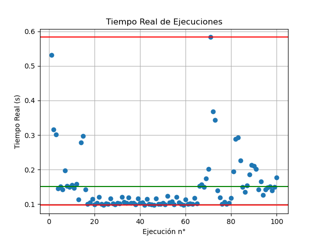
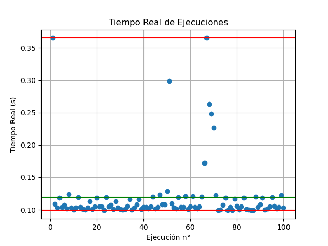
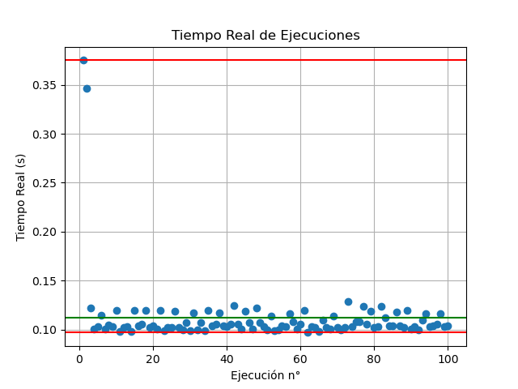
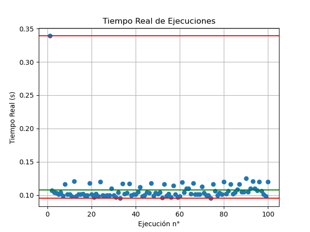
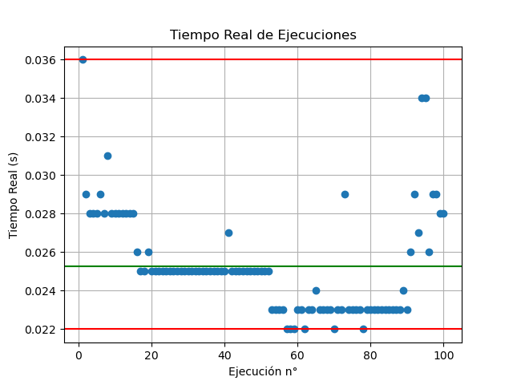

# Laboratorio n°3 - Introducción a la programación eficiente y performante

## Descripción
Dado un archivo "original.c" se realizará un análisis de tiempo de ejecución con el comando *time*.

Luego se realizará una serie de optimizaciones, guardadas en el archivo "laboratorio3.c" y se realizara el mismo análisis, verificando la ganancia de tiempo de ejecución.

Por último se utilizará el analizador dinámico [valgrind](https://valgrind.org) en el archivo "lab_valgrind.c" y se realizará las comparaciones correspondientes.

Para todos los análisis se realizarán 100 ejecuciones y se tomará la media como el tiempo de ejecución, disminuyendo así la probabilidad tomar valores afectados por la ejecución de otros procesos en el ordenador.

Acceso al repositorio: [gihub - branch develop](https://github.com/ICOMP-UNC/2023---soii---laboratorio-iii-F96G/tree/develop)

## Validación de datos
Para asegurar que el comportamiento del programa no se verá afectado con los nuevos cambios, se ejecutará un test de validación llamado *test_validación.py*. Para ello los elementos aleatorios ( *rand()* ) utilizarán siempre la misma semilla.


## Análisis del archivo original
Para el archivo "original.c" se puede observar el comportamiento sin optimizaciones.



Se puede observar que hay multiples valores atípicos, esto se debe al contexto del procesador durante la ejecución.

El tiempo medio registrado es de 0.15067s

## Optimización eliminación de memset()*
La función *alloc_matrix()* básicamente se encarga de alocar en memoria una matriz y se utilizaba la función *memset()* para realizar un primer relleno de esta.

```c
for(j=0; j<XDIM; j++)
        for(k=0; k<YDIM; k++)
            memset(&array[k][j], j, sizeof(double));
```

Pero la función *fill()* luego llena esta matriz de elementos aleatorios, por lo que el llenado anterior se puede evitar, quedando de la forma:

```c
double **alloc_matrix(void)
{
    int i, j, k;
    double **array;
    array = malloc(XDIM * sizeof(double *));
    for (i = 0; i < XDIM; i++)
        array[i] = malloc(YDIM * sizeof(double));
    fill(array);
    return array;
}
```

se observan los siguientes tiempos luego de la optimización:



el tiempo medio esta vez fue de 0.11921s, con una ganancia del 20.88%


## Fusión de alloc_matrix() y fill()
La función de *alloc_matrix()* ya recorre la matriz al querer guardar espacio en memoria, por lo que se puede fusionar para recorrer la matriz solo una vez, almacenando los valores a la vez que se almacena el espacio necesario.

La función *alloc_matrix()* se cambió por *generate_matrix()* para tener un nombre mas descriptivo.

```c
double **generate_matrix(void)
{
    srand(1);
    double **array;
    array = (double **)malloc((unsigned long)XDIM * sizeof(double *));
    for (int i = 0; i < XDIM; i++)
    {
        array[i] = (double *)malloc((unsigned long)YDIM * sizeof(double));
        for (int j = 0; j < YDIM; j++)
            array[i][j] = (double)(rand() % 100);
    }

    return array;
}
```

se observan los siguientes tiempos con esta optimización:



el tiempo medio fue de 0.112310s, con una mejora del 25.45%


## Eliminación de doble recorrido de for en compute()
La función *compute()* realiza un doble recorrido de fors de la forma:

```c
for (k = 0; k < 3; k++)
    for (l = 0; l < 3; l++)
    {
        int x = i + (l - 1);
        int y = j + (k - 1);
        dato = arr[x][y];
        tmp_sum[l * 3 + k] = 2 * (2 * kern[l][k] * dato) / 1000 + 1;

accum = 0;
for (k = 0; k < 3; k++)
    for (l = 0; l < 3; l++)
        accum = accum + tmp_sum[k * 3 + l];
```

esta operación se puede utilizar los mismos fors para obtener el mismo resultado:

```c
accum = 0;
for (int k = 0; k < 3; k++)
    for (int l = 0; l < 3; l++)
        accum += ((kern[l][k] * arr[i + (l - 1)][j + (k - 1)]) * 0.004 + 1);
}
```

los tiempos registrados son los siguientes:



el tiempo medio fue de 0.10756s, con una mejora del 28,61%

## Optimización de print
En este punto la optimización modificando los prints de los resultados es una mejora relativa, ya que modificaría el funcionamiento del programa en si, sin modificar los resultados obtenidos. Básicamente se puede escribir el resultado en un archivo *result*, evitando escribir por consola.

Se cambiará los *printf()* por *fprintf()*, almacenando el resultado en *results*.

los tiempos registrados son los siguientes:



el tiempo medio es de 0.025280s, con una mejora del 83.22%. Si bien esta mejora es sustancial, como se mencionó anteriormente implica una modificación en el comportamiento del programa, no asi en sus resultados.

## Mejoras con valgrind
Se realiza el análisis de la respuesta obtenida del analizador valgrind. 
- El analizador remarca liberar la memoria ocupada con *malloc()*. De esta forma el programa no quedará ocupando memoria luego de terminar su tarea.
- El analizador indica que existe una variable que no es inicializada, esta variable es *accum* en la función *compute()*
- 


el tiempo medio con valgrind fue de 0.11559 con una mejora del 23,28%

## Mejoras con valgrind vs optimización
En términos de tiempo de ejecución la versión modificada es mejor, aunque valgrind permite reconocer errores de manejo de memoria que se podrían no haber tenido en cuenta.

## Ejecución de tests
Para ejecutar el test de validación es necesario compilar nuevamente original.c pero con *srand(1)*.

Por otra parte el test de tiempos imprime los tiempos registrados en la actual ejecución de *laboratorio3*.