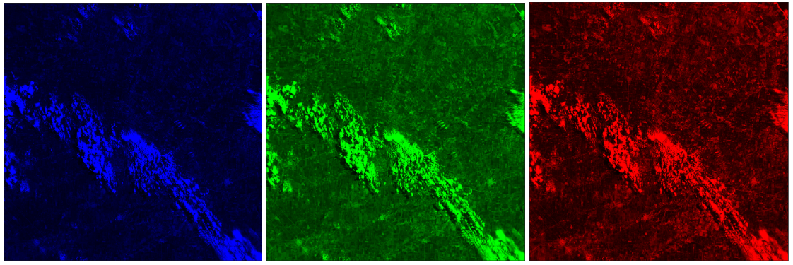
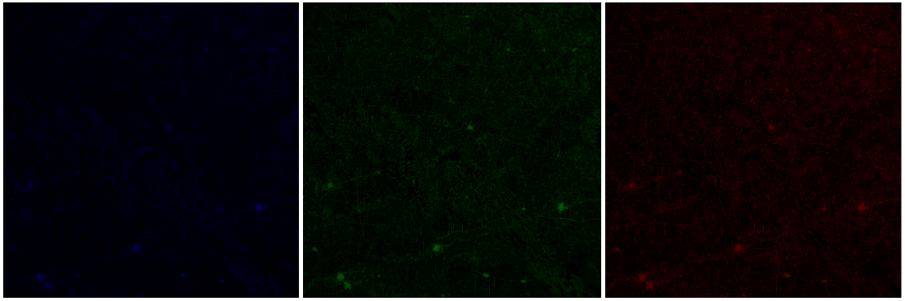
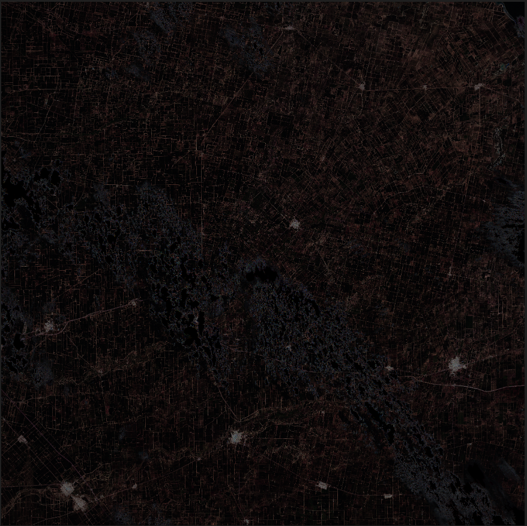
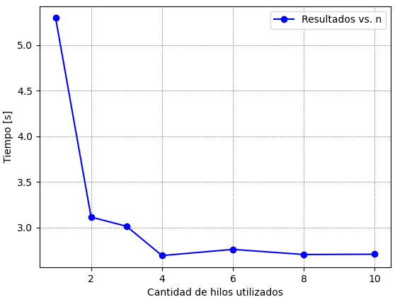

# Laboratorio n°4 - Memoria compartida.

## Descripción
Se trabajará sobre una imagen de formato ".tif", donde se extraerá las matrices RGB que la componen.



Con estas matrices se plantea realizar un filtrado de bordes.



Una vez filtradas estas se compone una imagen completa.



Para realizar esta tarea se utilizará la librería GDAL en conjunto con OpenMP, buscando agilizar el filtrado, disminuyendo el tiempo de ejecución utilizando multiples hilos (recursos).

Por ultimo se estudiará el tiempo de ejecución contra la cantidad de hilos utilizados.

## Librería GDAL
Para la utilización de GDAL se necesita instalar con
```
sudo apt-get install libgdal-dev
```

## Implementación

### Lectura de imagen
Para la lectura de los datos de la imagen original se utiliza GDAL, primero obteniendo los datos generales de la imagen:

```c
//Obtiene todos los registros de los tipo de archivos a leer.
GDALAllRegister();

GDALDatasetH hDataset = GDALOpen(file, GA_ReadOnly);

Bands bands;

GDALRasterBandH hRedBand = GDALGetRasterBand(hDataset, 1);
GDALRasterBandH hGreenBand = GDALGetRasterBand(hDataset, 2);
GDALRasterBandH hBlueBand = GDALGetRasterBand(hDataset, 3);

```

Donde `Bands` es una estructura con las matrices RGB y el tamaño original de la imagen.

### Lectura de matrices compuestas por la imagen
Una vez con los datos de cada imagen se guardará el arreglo que representa la matriz Red, Green y Blue.

```c
bands.red = getMatrixBand(hRedBand, bands.Size.x, bands.Size.y);
bands.green = getMatrixBand(hGreenBand, bands.Size.x, bands.Size.y);
bands.blue = getMatrixBand(hBlueBand, bands.Size.x, bands.Size.y);
```
donde

```c
uint8_t *getMatrixBand(GDALRasterBandH hBand, int xSize, int ySize){
    uint8_t *bandArray;

    bandArray = CPLMalloc(sizeof(uint8_t)*(size_t)xSize*(size_t)ySize);

    CPLErr error = GDALRasterIO(hBand, GF_Read, 0, 0, xSize, ySize, bandArray, xSize, ySize, GDT_Byte, 0, 0);
    if (error != CE_None)
    {
        perror("Error: No se pudo obtener la banda en getMatrixBand()");
        exit(EXIT_FAILURE);
    }
    
    return bandArray;
}
```

### Filtrado de cada matriz
Con cada matriz se realiza el filtrado (convolución)

```c
Bands filterBands(Bands bands, int threads){
    Bands filterBands;
    filterBands.Size = bands.Size;

    double timeStart = omp_get_wtime();

    filterBands.red = matrixConvolution(bands.red, bands.Size.x, bands.Size.y, threads);
    filterBands.green = matrixConvolution(bands.green, bands.Size.x, bands.Size.y, threads);
    filterBands.blue = matrixConvolution(bands.blue, bands.Size.x, bands.Size.y, threads);
    
    double timeEnd = omp_get_wtime();
    printf("%f\n", timeEnd-timeStart);

    return filterBands;
}
```
donde
```c
uint8_t *matrixConvolution(uint8_t *matrix, int xSize, int ySize, int threads){
    uint8_t *bandFilter = CPLMalloc(sizeof(uint8_t)*(size_t)xSize*(size_t)ySize);
    memset(bandFilter, 0, sizeof(uint8_t)*(size_t)xSize*(size_t)ySize);
    int accum = 0;
    uint8_t data = 0;
    int fKernel = sizeof(kernel) / sizeof(kernel[0]);
    int cKernel = sizeof(kernel[0]) / sizeof(int);

    omp_set_num_threads(threads);
    #pragma omp parallel for collapse (2)
    for (int i = 1; i < xSize - 1; i++){
        for (int j = 1; j < ySize - 1; j++){
            accum = 0;
            for (int k = 0; k < fKernel; k++){
                for (int l = 0; l < cKernel; l++){
                    int x = i + (k-1);
                    int y = j + (l-1);
                    data = matrix[(xSize*x)+y];
                    accum += (kernel[k][l]*data);
                }
            }
            if (accum < 0){
                accum = 0;
            }else if(accum > 255){
                accum = 255;
            }
            bandFilter[xSize*i + j] =(uint8_t) accum;
        }
    }

    return bandFilter;
}
```

Aquí se utiliza OpenMP para paralelizar la operación por la cantidad de hilos con `#pragma omp parallel for collapse (2)` donde el numero de hilos con cual se va a trabajar se define con `omp_set_num_threads(threads);`

Para medir cuanto tiempo demanda los filtrados se utiliza `omp_get_wtime();`


### Escritura de la nueva imagen
Para la escritura de la nueva imagen filtrada se utiliza las matrices ya filtradas.

```c
void saveImage(Bands bands){
    GDALDriverH hDriver = GDALGetDriverByName("GTiff");
    if (hDriver == NULL)
    {
        perror("Error: No se pudo crear hDriver");
        exit(EXIT_FAILURE);
    }
    
    char **papszOptions = NULL;
    GDALDatasetH hDataset = GDALCreate(hDriver, "edge_filter.tif", bands.Size.x, bands.Size.y, 3, GDT_Byte, papszOptions);

    GDALRasterBandH hRedBand = GDALGetRasterBand(hDataset, 1);
    saveBand(hRedBand, bands.Size.x, bands.Size.y, bands.red);
    GDALRasterBandH hGreenBand = GDALGetRasterBand(hDataset, 2);
    saveBand(hGreenBand, bands.Size.x, bands.Size.y, bands.green);
    GDALRasterBandH hBlueBand = GDALGetRasterBand(hDataset, 3);
    saveBand(hBlueBand, bands.Size.x, bands.Size.y, bands.blue);

    GDALClose(hDataset);
}
```
donde
```c
void saveBand(GDALRasterBandH hBand, int xSize, int ySize, uint8_t *arrayBand){
    CPLErr error = GDALRasterIO(hBand, GF_Write, 0, 0, xSize, ySize, arrayBand, xSize, ySize, GDT_Byte, 0, 0);
    if (error != CE_None)
    {
        perror("Error: No se pudo guardar la banda en saveBand()");
        exit(EXIT_FAILURE);
    }
}
```

## Resultados de tiempo contra cantidad de hilos
Para una computadora con un procesador de 2 núcleos y 4 hilos se observa el siguiente comportamiento:



Se puede ver que a medida que se utilizan mas hilos el tiempo disminuye pero se observa un estancamiento en la disminución de tiempos una vez que se alcanzó la cantidad de hilos que posee el CPU utilizado.