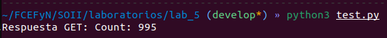
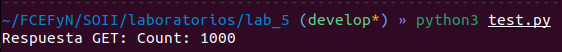

# Laboratorio n°5 - Sistemas Embebidos.

## Descripción
Para el presente trabajo se desarrollara un servidor que levante una APIRest, esta responde a mensajes del tipo:
- `POST: http://localhost:8537/increment`: Incrementa un contador interno con la cantidad pasada por un JSON.
- `GET: http://localhost:8537/imprimir`: Devuelve el valor del contador.

El JSON tiene la siguiente estructura:

``` 
{
    "number": (int number)
}
```

Para el test de este servidor se utilizara el comando `curl` en un script de python, lanzando 1000 peticiones POST incrementando el contador del servidor en 1 por cada petición.

## Librerías
Se utilizaron las librerías de ulfius y jansson. Para su instalación ejecutar:

``` 
sudo apt-get install libulfius-dev
sudo apt-get install libjansson-dev
```

## Implementación
### Instancia del servidor
Se crea una instancia del servidor con dos endpoints, uno para el GET y el otro para el POST, cada uno con su propia rutina.

```c
// Inicializa la instancia del servidor con el puerto declarado.
ulfius_init_instance(&instance, PORT, NULL, NULL)

// Dos endpoints declarados
ulfius_add_endpoint_by_val(&instance, "POST", "/increment", NULL, 0, &callback_post_increment, NULL);
ulfius_add_endpoint_by_val(&instance, "GET", "/imprimir", NULL, 1, &callback_get_imprimir, NULL);

// Start the framework
ulfius_start_framework(&instance)
```

### Callback de la petición GET
Cada vez que el servidor reciba una petición GET este devuelve el total del contador interno `count`.

```c
int callback_get_imprimir (const struct _u_request * request, struct _u_response * response, void * user_data) {
    char response_text[15];
    snprintf(response_text, sizeof(response_text), "Count: %d", count);
    
    ulfius_set_string_body_response(response, 200, response_text);
    return U_CALLBACK_CONTINUE;
}
```

### Callback de petición POST
Cada vez que el servidor reciba una petición POST este extrae del mensaje JSON obtenido la cantidad a incrementar (o decrementar).

```c
int callback_post_increment(const struct _u_request * request, struct _u_response * response, void * user_data){

    // Leer el cuerpo de la solicitud como JSON
    json_t *json_body = ulfius_get_json_body_request(request, NULL);
    json_t *json_number = json_object_get(json_body, "number");
    int number = (int) json_integer_value(json_number);

    //Incrementa el contador interno
    count += number;

    //Responde la petición con un mensaje vació con código de 204
    ulfius_set_empty_body_response(response, 204);

    return U_CALLBACK_CONTINUE;
}
```

Cabe destacar que hasta el momento no se aplico ninguna exclusion mutua para la variable `count`, por lo que se puede esperar que esta se corrompa.

## Prueba
Para corroborar el correcto funcionamiento del servidor se realizará 1000 peticiones POST a traves de un script de python, cada petición aumenta en 1 el contador global del servidor.

### Prueba sin tener en cuenta la exclusión mutua
Primero se ejecutara el test sin tener en cuenta la exclusión mutua para multiples accesos.



Se puede observar como a pesar de que se realizaron 1000 peticiones POST el contador se corrompió y solo conto 995.

### Pruebas con exclusión mutua
Para el uso de la exclusión mutua se utilizara la librería `semaphore`, por lo que el acceso a escritura del contador queda de la siguiente forma:

```c
sem_wait(&mutex); 
count += number;
sem_post(&mutex);
```

De esta forma ahora al realizar el test se obtiene el contador funcionando de manera correcta:

