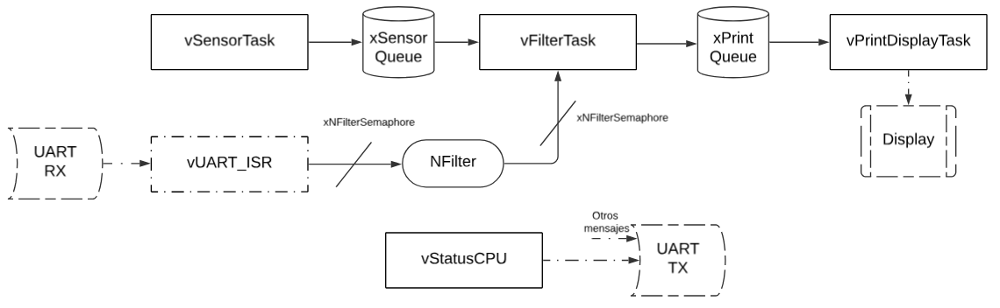
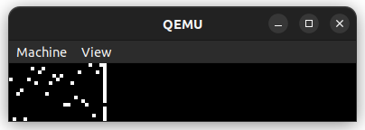
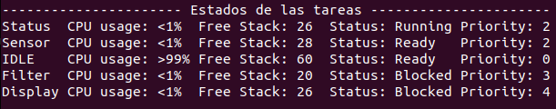
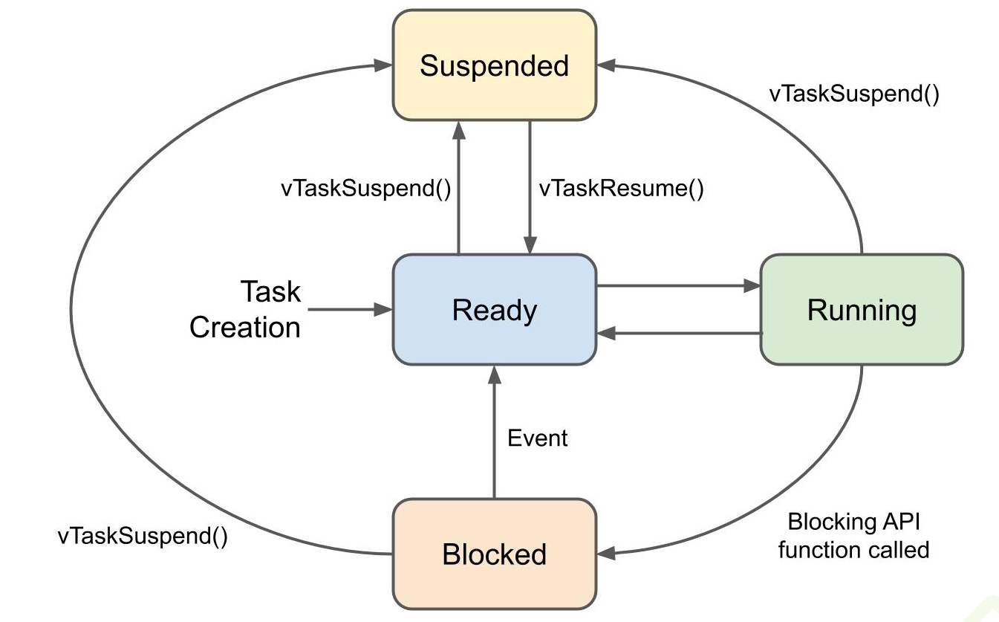

### Lab7 Sistemas Operativos II
## Ingeniería en Compuatación - FCEFyN - UNC
# Sistemas Operativos en Tiempo Real

## Introducción
Toda aplicación de ingeniería que posea requerimientos rigurosos de tiempo, y que este controlado por un sistema de computación, utiliza un Sistema Operativo de Tiempo Real (RTOS, por sus siglas en inglés). Una de las características principales de este tipo de SO, es su capacidad de poseer un kernel preemtive y un scheduler altamente configurable. Numerosas aplicaciones utilizan este tipo de sistemas tales como aviónica, radares, satélites, etc. lo que genera un gran interés del mercado por ingenieros especializados en esta área.

## Objetivo
El objetivo del presente trabajo practico es el de diseñar, crear, comprobar y validar una aplicación de tiempo real sobre un
RTOS.

## Desarrollo
Se realizará un aplicativo que sera ejecutado en el emulador qemu para la placa de desarrollo LM3S811. El aplicativo debe:

- Tener una tarea que simule un sensor de temperatura. Generando valores aleatorios, con una frecuencia de 10 Hz.
- Tener una tarea que  reciba los valores del sensor y aplique un filtro pasa bajos. Donde cada valor resultante es el promedio de las ultimas N mediciones.
- Una tarea que grafica en el display los valores de temperatura en el tiempo.
- Se debe poder recibir comandos por la interfaz UART para cambiar el N del filtro.
- Implementar una tarea que muestre periódicamente estadísticas de las tareas (uso de cpu, uso de memoria, etc), ademas de calcular el stack necesario para cada tarea.

### Implementación
Las tareas siguen el siguiente esquema:



Algunas consideraciones son:
- UART RX espera un valor numérico entre 1 y 9.
- NFilter es una variable que se accede con el semáforo xNFilterSemaphore para no corromper su valor.
- NFilter determina la cantidad de valores a promediar para realizar el filtro pasa bajo.
- UART TX no solo recibe mensajes de vStatusCPU, sino que todo el aplicativo maneja el UART para distintos tipos de mensajes.


#### vSensorTask
Esta tarea se encarga de "leer los valores obtenidos del sensor de temperatura", en este caso se obtiene un valor aleatorio para simular este sensor, a una frecuencia de 10Hz.

```c
void vSensorTask(void *pvParameters)
{
	int iRandomNumber;

	for (;;)
	{
		// Genera un número aleatorio
		iRandomNumber = get_random_int();
		xQueueSend(xSensorQueue, &iRandomNumber, portMAX_DELAY);
		vTaskDelay(100);
	}
}
```

una vez obtenido el valor se almacena en *xSensorQueue*.

#### vFilterTask
Esta tarea obtiene de *xSensorQueue* los datos del sensor y se lee el dato de *NFilter* para realizar el filtrado pasa bajo con los *NFilter* valores.

```c
void vFilterTask(void *pvParameters)
{
	int valuesSensor[NFilterMax];
	int newValue;
	int index = 0;
	uint8_t N = NFilterMax - 1;

	for (;;)
	{
		xQueueReceive(xSensorQueue, &newValue, portMAX_DELAY);

		xSemaphoreTake(xNFilterSemaphore, portMAX_DELAY);
		N = NFilter;
		xSemaphoreGive(xNFilterSemaphore);

		// desplaza el arreglo para agregar el nuevo dato
		for (int i = N - 1; i > 0; i--)
		{
			valuesSensor[i] = valuesSensor[i - 1];
		}

		// Guarda el nuevo dato en la posición 0
		valuesSensor[0] = newValue;

		index++;

		if (index == 10)
		{
			index = 0;

			int prom = 0;
			for (int i = 0; i < N; i++)
			{
				prom += valuesSensor[i];
			}
			prom = prom / N;

			xQueueSend(xPrintQueue, &prom, portMAX_DELAY);
		}
	}
}
```

Cada 10 datos nuevos ingresados se almacena el filtrado en *xPrintQueue* para graficarlo. Se realiza cada 10 datos para mantener el dibujado de un nuevo dato cada 1s.

#### vPrintDisplayTask
Por ultimo, para el trabajo con el sensor, se grafica en el display los datos leidos de *xPrintQueue*. Los datos se grafican de forma que el ultimo valor leído se simboliza con un led apagado (con los demas encendidos) y todos los anteriores de forma contraria, donde el led encendido es el dato. Esto facilita la lectura del ultimo dato obtenido.



La frecuencia de dibujado de este esta determinado por la frecuencia en la que se almacenan los datos en la cola, ademas del acceso a la tarea.

#### vStatusCPU
Esta tarea se encarga de imprimir el estado de las tareas del aplicativo, para eso se utiliza la UART para transmitir la información.



Se puede apreciar como gran parte del uso del CPU es el estado de IDLE, esto se debe a que las tareas pasan gran parte de su tiempo esperando un nuevo dato o realizando un sleep.

Para el estado de las tareas se puede visualizar como estas cambian de un estado a otro:



## Simulación con qemu
Para poder probar el aplicativo se debe ejecutar con qemu, con el comando:
```
qemu-system-arm -machine lm3s811evb -kernel gcc/RTOSDemo.axf -serial stdio
```

`-serial stdio` permite visualizar la salida y entrada UART.